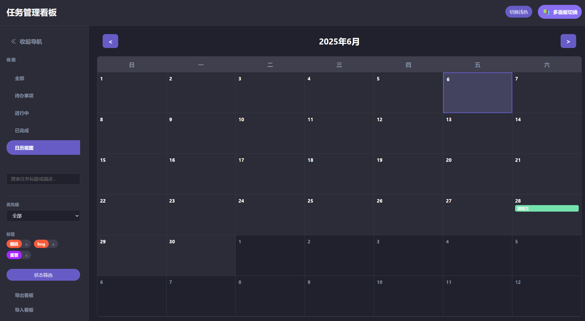

# 任务管理看板 (Kanban Board)

一个功能完整的任务管理应用，支持看板视图、日历视图和任务提醒功能。

 



## 功能特点

### 核心功能
- **任务管理**：创建、编辑、删除任务
- **看板视图**：将任务分为待办/进行中/已完成三列
- **拖拽操作**：通过拖拽改变任务状态
- **子任务系统**：为任务添加子任务并跟踪进度
- **日历视图**：按日期查看任务分布
- **任务提醒**：设置任务截止提醒（需要浏览器通知权限）

### 任务属性
- 标题、描述、截止日期
- 优先级（高/中/低）
- 自定义标签（支持标签颜色）
- 状态（待办/进行中/已完成）

### 高级功能
- **深色/浅色主题**：一键切换主题
- **多面板模式切换**：看板和子任务面板自由切换
- **搜索与筛选**：按关键词、状态、优先级、标签筛选任务
- **日历视图**：按日期查看任务分布
- **任务提醒**：设置任务截止提醒
- **子任务管理**：添加、编辑、删除子任务，跟踪进度
- **数据导入/导出**：方便备份和迁移数据
- **响应式设计**：适配移动设备
- **本地存储**：使用localStorage保存所有数据
- **任务进度条**：直观显示子任务完成情况

## 使用方法

### 基本操作
1. **添加任务**：点击列顶部的"+"按钮
2. **编辑任务**：点击任务卡片的"⋮"菜单 > "编辑"
3. **删除任务**：点击任务卡片的"⋮"菜单 > "删除"
4. **移动任务**：拖拽任务到不同状态列
5. **添加子任务**：展开任务卡片 > 在输入框中添加

### 视图切换
- 使用左侧导航栏切换视图：
  - **看板视图**：默认视图
  - **日历视图**：按月查看任务分布
  - **筛选视图**：按状态单独查看（待办/进行中/已完成）

### 高级功能
- **设置提醒**：在任务编辑表单中选择提醒时间
- **使用标签**：在任务编辑时添加逗号分隔的标签
- **搜索任务**：在左侧搜索框输入关键词
- **切换主题**：点击右上角的"切换主题"按钮

## 技术细节

### 文件结构
```
kanban-project/
├── index.html          # 主页面
├── css/                # 样式文件夹
│   ├── variables.css 等
├── assets/             # 资源文件夹
│   ├── image.png       # 示例图片
│   ├── image2.png      # 示例图片
│   └── README.md       # 项目文档
├── js/                 # 脚本模块
│   ├── main.js
│   └── ...
```

### 技术栈
- HTML5
- CSS3
- JavaScript（ES6+）
- Web Storage API（localStorage）

### 数据存储
所有任务数据存储在浏览器的localStorage中，键名：
- `kanban_tasks`：任务数据
- `kanban_labels`：标签数据
- `kanban_theme`：主题偏好
- `kanban_view`：视图状态

## 运行说明
1. 克隆或下载项目
2. 直接在浏览器中打开`index.html`
3. 无需服务器或额外依赖

> **注意**：数据保存在浏览器本地，清除缓存将导致数据丢失

## 未来扩展
- 可视化统计仪表板与分析报告
-  高级筛选与视图自定义

